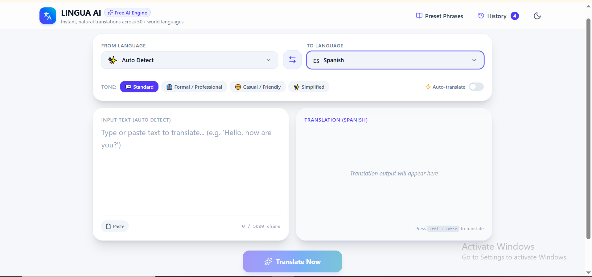
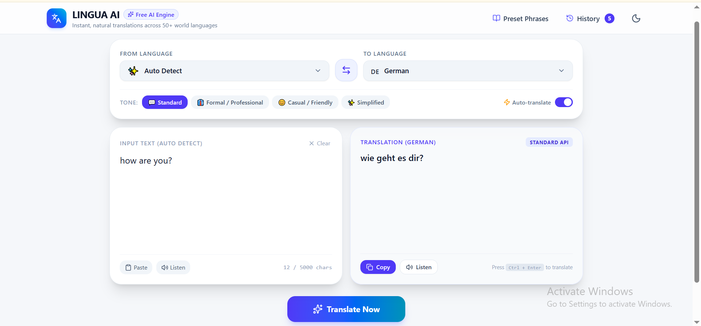

# 🌐 AI Language Translator

An AI-powered Language Translator built using **React**, **TypeScript**, **Tailwind CSS**, and **Express** as part of my **CodeAlpha AI Internship**.

## 🚀 Features

- 🌍 Translate text between multiple languages
- 🔄 Swap source and target languages
- 📋 Copy translated text
- 🔊 Text-to-Speech
- 🌙 Dark Mode
- 📜 Translation History
- 📱 Responsive Design

## 🛠️ Tech Stack

- React
- TypeScript
- Tailwind CSS
- Express
- Vite

## 📷 Screenshots

### Home Page



### Translation



### Dark Mode


### History


## ⚙️ Installation

```bash
npm install
npm run dev
```

## 👨‍💻 Author

**Faisal K**